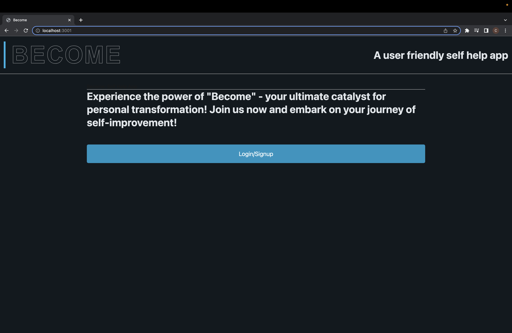
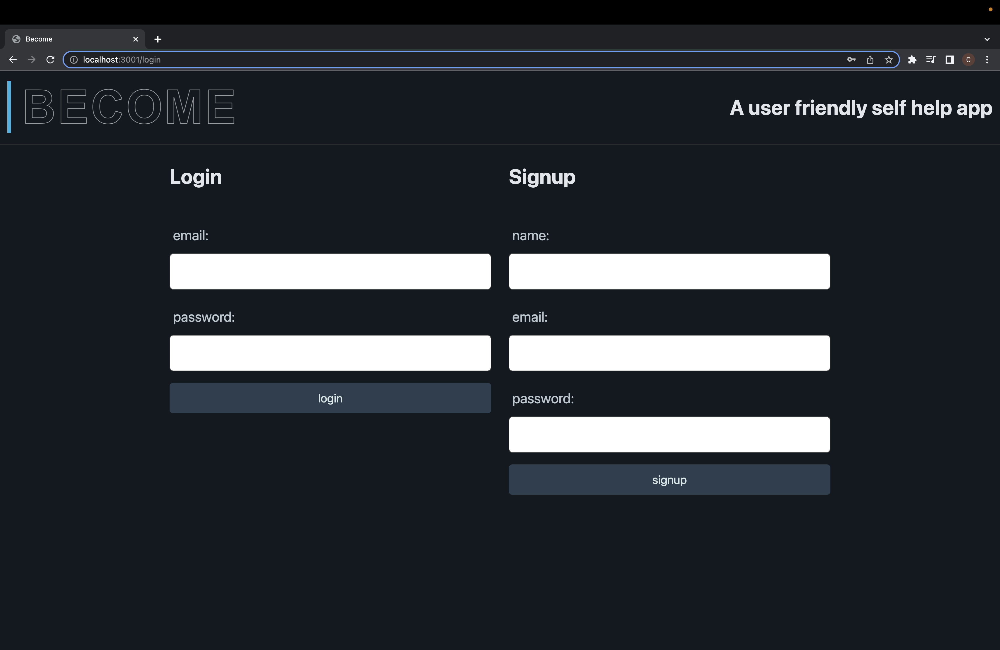
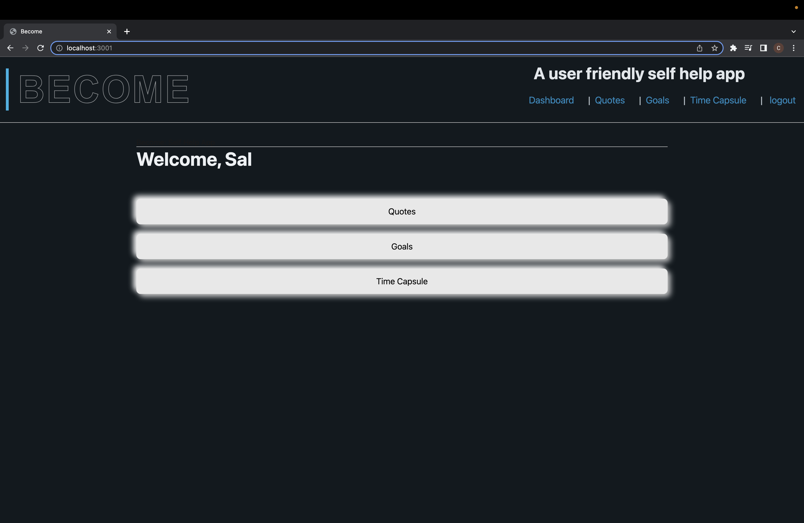
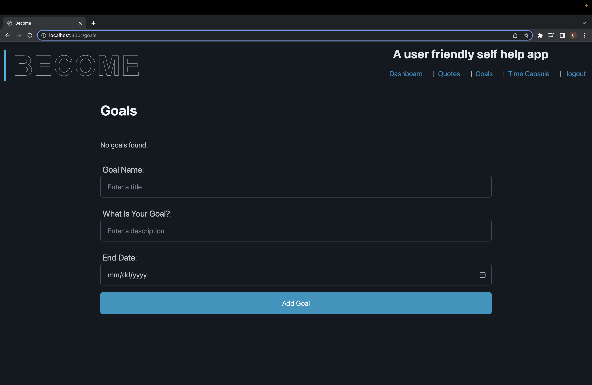
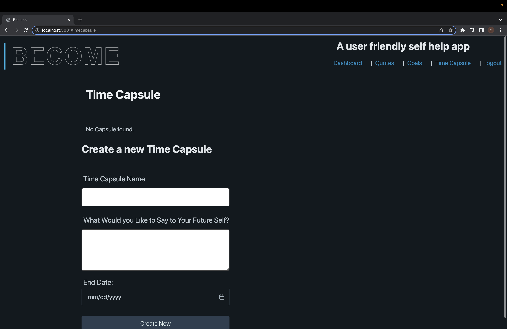

# Become

## Table of Contents
* [Description](#description)
* [Installation](#installation)
* [Usage](#usage)
* [License](#license)
* [Contributing](#contributing)
* [Questions](#questions)
## Description
Become is an easy to use app where the user will be inspired by looking at inspirational quotes, then have the option to create new goals, and also create a time capsule message to themselves to follow up with their goals and reflect on their progress. This is an interactive full stack application that uses node.js, express.js, mysql, sequelize, handlebars.js, pico.css, and uiverse styling.

Here is a link to the deployed application on Heroku: 
https://becomethebestyou.herokuapp.com/

## Installation
npm i, mysql, source schema.sql, node seed/seeds.js
## Usage
npm start
## License

## Contributing
https://github.com/connormcgrew
https://github.com/Evermuniz
https://github.com/Conneroc03
## Questions
If you have any questions, please contact me at [tyler.mifflin1@hotmail.com](mailto:tyler.mifflin1@hotmail.com) or visit my [GitHub profile](https://github.com/tylermifflin)
